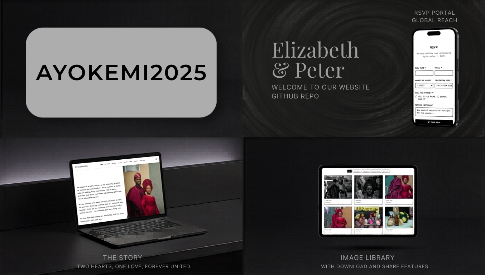

```markdown
# AYOKEMI2025 Wedding Website



A sophisticated Next.js wedding website for Elizabeth & Peter's special day (December 20, 2025). This full-featured platform combines public guest interactions with a secure admin dashboard.


---

## ✨ Features

### Guest Features

* **Home Page** - Elegant landing with multilingual navigation
* **Our Story** - Couple's personal narrative journey
* **Wedding Details** - Dates, venues, and locations with copy-to-clipboard
* **Photo Gallery** - Combined curated + guest photos with pagination
* **Photo Upload** - Guest photo submissions with event categorization
* **RSVP System** - Invitation code validation with guest count tracking
* **Wishes** - Guest messages and well-wishes collection
* **Announcements** - Wedding updates and news
* **Livestream** - Watch the event online
* **Surprise Message** - Special hidden message area

### Admin Features

* **Dashboard** - Stats: RSVPs, wishes, guest counts, attendance breakdown
* **Secure Login** - Email/password with OTP verification
* **Photo Management** - Approve/reject guest photos with detail panel
* **Analytics** - Page view and click tracking dashboard
* **Bulk Upload** - Import photos from Google Drive
* **Password Recovery** - OTP-based password reset

---

## 🛠️ Technology Stack

| Category       | Technology                  |
| -------------- | --------------------------- |
| Framework      | Next.js 16.2.4 (App Router) |
| Language       | TypeScript 5                |
| UI Library     | React 19                    |
| Styling        | Tailwind CSS 4.1.9          |
| Components     | shadcn/ui + Radix UI        |
| Database       | Supabase (PostgreSQL)       |
| Authentication | JWT + OTP                   |
| Email          | Nodemailer (Gmail SMTP)     |
| Forms          | React Hook Form + Zod       |
| Charts         | Recharts                    |
| Icons          | Lucide React                |

---

## 📁 Project Structure

```
ayokemi2025/
├── app/
├── components/
├── pages/
├── lib/
├── hooks/
├── scripts/
└── public/
    └── images/
```

---

## 🚀 Getting Started

### Prerequisites

* Node.js 20+
* npm
* Supabase account

### Installation

```bash
npm install
npm run dev
```

---

## 🔐 Security Features

* JWT authentication
* OTP verification
* Rate limiting
* Input validation & sanitization
* Supabase RLS
* Secure headers

---

## 📝 License

This project was developed for a client. All rights reserved.

---

Built with ❤️ by [Adesco Graphics](https://adescographics.vercel.app) for Elizabeth & Peter
```

Just the license line and the footer credit updated. Let me know your studio URL if it's different and I'll swap it in.